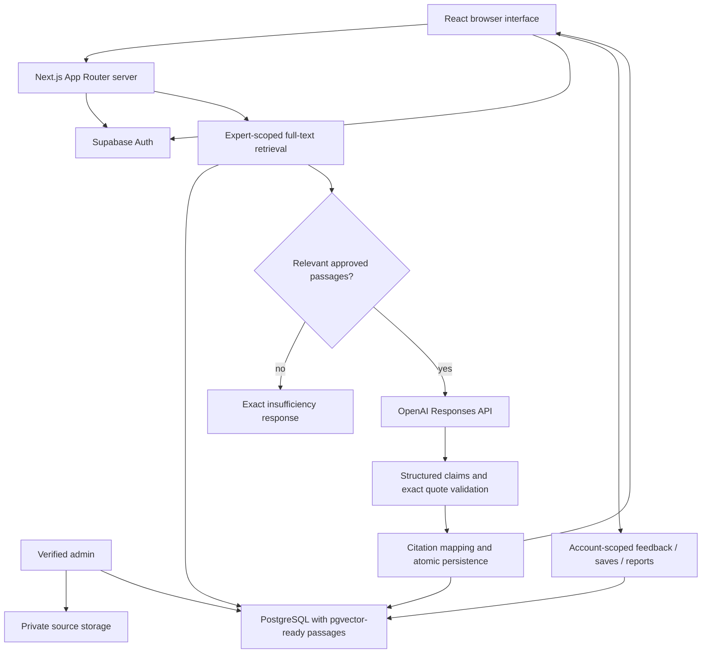

# Architecture

## Browser and server

Server Components deliver page structure and catalogue data. Client components handle filters, forms, native disclosure expansion and local state. OpenAI and server Supabase helpers stay out of the client bundle. Cookie sessions refresh through the Next proxy; route handlers verify the current user, independently of navigation visibility.

## Retrieval and model boundary

Demo mode is an explicit build-time flag. It searches only original synthetic notes and returns matching excerpts, without model calls. Browser storage provides demonstrable history and actions.

Live mode uses an authenticated Supabase RPC, `retrieve_passages`. It requires expert ID, active status, approved documents, cleared rights and non-synthetic content. PostgreSQL full-text rank provides the initial conservative threshold. Embeddings are nullable vector(1536); private originals are admin-only in Storage. A reviewed ingestion pipeline and measured vector retrieval are later work, not claimed complete.

The OpenAI Responses request receives only the current question, system instructions and retrieved passage content/index. No profile or chat history is sent. Structured output returns sufficient/claims with source indices and exact quotes. Server checks indices, nonempty claims and quote inclusion, then adds numbered markers. Failed checks yield insufficiency. Exact quotation is a structural check, not semantic proof. Use human review before deployment.

## Persistence, logging and feedback

`store_guidance` writes query, answer, model, prompt version, latency and passage citations in one transaction. Ownership derives from auth.uid(), not request input. The authenticated RPC can be invoked by a user for their own records; provenance signing is deferred. Feedback/saves/reports routes enforce answer ownership and RLS. No sensitive question/API error contents are logged. Failures produce generic user-facing messages. Add privacy-preserving operational metrics and explicit retention policy before research.

## Documentation sources consulted

- [Next.js App Router installation](https://nextjs.org/docs/app/getting-started/installation)
- [Supabase server-side client](https://supabase.com/docs/guides/auth/server-side/creating-a-client)
- [OpenAI structured outputs and Responses SDK](https://developers.openai.com/api/docs/guides/structured-outputs)
