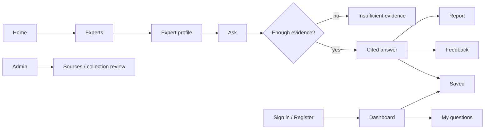

# Layout wireframes

Low-fidelity planning evidence corresponding to the implemented screens. Text order is reading order. On mobile, columns stack left-to-right in DOM order and navigation expands below the header.

```text
HOME
┌ Wordmark ─ Home · Experts · How It Works · About ─ Sign In · Get Started ┐
│ [Demo disclosure banner]                                               │
│ Value proposition               │ Example question                     │
│ Three-line headline             │ Answer with [1] citation              │
│ Supporting copy                 │ Source title + synthetic label        │
│ Explore Experts · Ask NiaGuide   │ Supporting-passage signal             │
├ Sources you can inspect · African perspectives · AI transparency ──────┤
│ Featured collections heading                    View all →             │
│ Expert card                     Expert card               Demo card    │
│ Three numbered steps: choose → ask → inspect                            │
│ Trust explanation               │ Source / disclosure / judgment       │
│ Final call to action                                                   │
└ Footer: explore · student space · independent project disclosure ───────┘

EXPERT DISCOVERY
Heading + independent catalogue explanation
[Search_________________] [Field ▼] [Country ▼] [Status ▼]
Result count / reset
[Initials, status, name, field, country, source count] × responsive grid
Empty state when nothing matches

EXPERT PROFILE
Back to catalogue
Initials · Name · Status · Field · Country
[Neutral profile + disclosure]      [Source count · Ask button]
[Expandable source list]            [Unavailable collection explanation]

ASK / ANSWER
Heading
[Selected collection ▼]             [Specific-question guidance]
[Synthetic demo notice]             [Retrieval process]
[Question textarea________]
[Privacy warning · Examples]
[Submit] → Loading | Error | Evidence insufficient
[Answer with [1], [2] anchors]
[Expandable title/type/date/link/passage for each citation]
[Persistent disclosure]
[Save] [Helpful] [Not Helpful] [Report → reason form] [Follow-up]

STUDENT WORKSPACE
Dashboard · Experts · Ask · My Questions · Saved · Profile · Sign Out
Welcome + demo-local storage explanation
[Question count] [Saved count] [Demo collection count]
[Recent questions → expand answer] OR [new-user empty state]
[Guidance categories] [Suggested collections]

ADMIN
Overview · Experts · Sources · Collections · Reports · Feedback · Settings
Counts: experts / documents / passages / questions / reports
Expert table with status controls
Document metadata and rights/approval table
Collection queue · reported answer queue · feedback counts
Server-side settings explanation

AUTH
Wordmark / heading
[Display name (register only)]
[Email] [Password]
[Submit → loading / success / error]
Switch sign-in/register · Explore demo
```

## Route map


