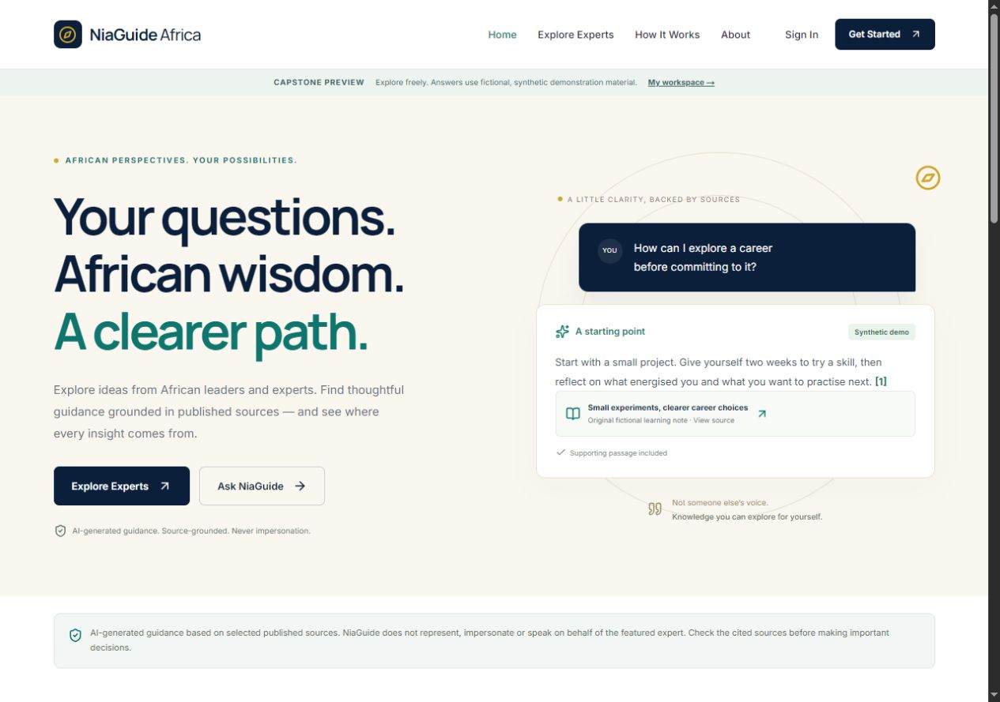
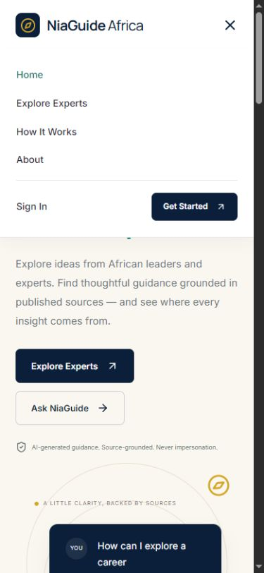
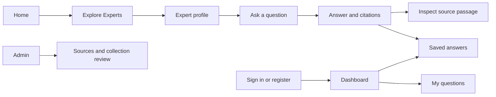
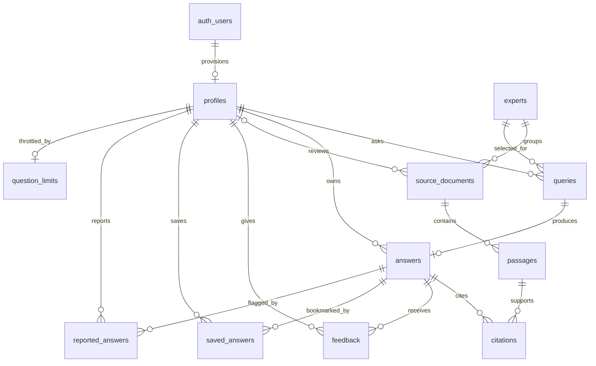

# NiaGuide Africa submission evidence

Initial Full Stack software product demonstration

NiaGuide Africa provides source-grounded guidance for young Africans aged 18–25. This document connects the initial MVP to the assignment rubric and gives the assessor direct routes to the design, code and data-model evidence.

**Demonstrated scope.** The working preview uses original fictional Amara Okeke notes, retrieved excerpts and browser-local history. Twenty real-expert profiles remain drafts. Live authentication, database persistence and OpenAI generation have implementation code but have not been verified with configured services.


### Rubric to evidence

| Criterion | Evidence and location | What the assessor can check |
| --- | --- | --- |
| Requirements and tools<br>5 points | Specification and tool rationale below; design decisions on page 3.<br>docs/PROJECT_SPEC.md | Scope fits the FullStack track; source grounding and non-impersonation guide the implementation. |
| Development environment<br>5 points | package.json, package-lock.json, .env.example; checks on page 6.<br>docs/VERIFICATION.md | Recorded lint, typecheck, six tests and production build passed. Fresh-extract setup remains to be checked. |
| Navigation and layout<br>5 points | Annotated screens on page 2; wireframes on page 3; React/CSS on page 5. | Desktop/mobile navigation, collection search, question-to-source flow and saved-answer navigation. |


### Tools chosen for the requirements

| Tool | Reason for selection |
| --- | --- |
| Next.js with React and TypeScript | App Router pages, reusable interactive components and server routes in one typed project. |
| Tailwind CSS and shared CSS | Theme tokens and responsive layout rules; Lucide icons; Manrope headings and Inter body text. |
| Supabase | Planned Auth, PostgreSQL, RLS and private source storage. SQL migrations are supplied for manual setup. |
| OpenAI SDK and Zod | Server-only Responses integration; validation and structured output checks. No custom model training. |
| npm and Git | Lockfile-based installation and review branch. Test/build commands are recorded in the README. |

Assessment guide, not a predicted mark. The submission also needs the actual GitHub link, a 5–10-minute demo video and the final repository ZIP.


## Interface evidence

Numbered annotations identify the design decisions visible in the running application.






1. A clear public navigation bar separates discovery, process information and account entry.

2. A short, high-contrast value proposition establishes purpose before asking the visitor to act.

3. Explore Experts and Ask NiaGuide provide two direct entry points into the main journey.

4. The example labels synthetic content and places its source beside the guidance.

5. On mobile, a labelled toggle opens a vertical menu. aria-expanded exposes its state to assistive technology.

Verification: the main question, source expansion, save, feedback and report actions were exercised in-browser. The mobile landing and Ask screens were checked for horizontal overflow.


## Wireframes and visual design

Low-fidelity summaries of the implemented information architecture, not a claim of completed user research.


### Style guide and design rationale

| Colour | Hex |
| --- | --- |
| Navy | #0B1F3A |
| Gold | #D4A72C |
| Emerald | #0F766E |
| Cream | #FAF7F0 |
| Text | #1F2937 |

Manrope headings and Inter body text establish hierarchy. Cream surfaces reduce visual noise; navy supports strong contrast; gold marks accents and keyboard focus. Status uses words as well as colour. Mobile grids stack and the menu becomes vertical.

Process: requirements → user journeys → wireframes → reusable components → desktop/mobile checks. A mobile overflow issue found during testing was corrected. Detailed decisions: docs/DESIGN_SYSTEM.md and docs/WIREFRAMES.md.



Wireframe layouts: Home pairs the value proposition with an example and source; Explore places filters before cards; Ask places the collection and question before an answer and evidence; the workspace prioritises questions and saves; Admin groups collections and review queues; Auth keeps the form compact.


## Database relationships

Implemented migration design. Remote application and live RLS isolation testing are still pending.


### Student actions linked to answers

Each action row references one profile and one answer; either parent can have zero or many action rows. Additional ownership links: profiles → answers (1 to many); profiles → document reviewers (one to many, optional per document). Profile IDs reference auth.users (one to zero or one profile).

**Controls in the migration.** UUID keys, foreign keys, indexes, RLS policies, private source storage and model/prompt/latency fields. The internal question_limits table has one row per user for atomic live-request throttling. Embeddings are nullable; initial live retrieval is full-text search.





## Frontend implementation examples

Selected implementation excerpts. Omitted surrounding code is available at the repository paths shown.


### Example 1 Responsive layout and navigation

CSS changes the menu and content grid below 780 px. React manages the toggle state and exposes it through aria-expanded; navigation links also close the menu.


src/components/header.tsx · lines 14–21; open is React state

```tsx
<button
  className="menu-toggle"
  aria-label="Toggle navigation"
  aria-expanded={open}
  onClick={() => setOpen(!open)}
>
  {open ? <X /> : <Menu />}
</button>
```


src/app/globals.css · selected rules from lines 1118–1211, compacted

```tsx
@media (max-width: 780px) {
  .menu-toggle { display: block; }
  .main-nav { display: none; /* other styles omitted */ }
  .main-nav.open { display: flex; }
  .hero-grid { grid-template-columns: 1fr; }
  .grid-3 { grid-template-columns: 1fr; }
}
```

**Visible outcome.** Desktop links become a mobile menu and cards stack in one column. Labels, aria-current and visible focus support keyboard navigation.


### Example 2 React filtering interaction

Controlled inputs update React state. The derived catalogue combines search, country, field and collection status; the UI shows the result count or an empty state.


src/components/explorer.tsx · lines 14–20

```tsx
const filtered = experts.filter(
  (e) =>
    (e.name + " " + e.field).toLowerCase().includes(search.toLowerCase()) &&
    (!country || e.country === country) &&
    (!field || e.field.toLowerCase().includes(field.toLowerCase())) &&
    (!status || e.status === status),
);
```


Search input binding · lines 30–31

```tsx
value={search}
onChange={(e) => setSearch(e.target.value)}
```

**Observed check.** Searching “Ngozi” returns two names. Adding the Economics filter narrows the result to one. Reset clears every filter; Available returns only fictional Amara in demo mode.


## Backend implementation and verification

Example 3 shows validation, retrieval and citation response, with a clear boundary between demo and live paths.


### Example 3 Validate then retrieve then cite

The API rejects invalid questions. It starts with an insufficient-evidence result and replaces that result only when supporting passages are available.


src/lib/retrieval.ts · lines 3–10

```tsx
export const questionSchema = z.object({
  expertId: z.uuid(),
  question: z
    .string()
    .max(1200, "Keep your question under 1,200 characters.")
    .transform((s) => s.replace(/[\u0000-\u001f\u007f]/g, " ").trim())
    .pipe(z.string().min(12, "Ask a question of at least 12 characters.")),
});
```


src/app/api/ask/route.ts · lines 39–51 · verified synthetic path

```tsx
if (demoMode) {
  const sources = retrieveDemo(expertId, question);
  if (sources.length) {
    result.sources = sources;
    result.answer = sources
      .map((s, i) => `${s.content} [${i + 1}]`)
      .join("\n\n");
    result.insufficient = false;
    result.model = "synthetic-extractive-demo-v1";
  }
  result.latencyMs = Date.now() - started;
  return Response.json(result);
}
```

The live path verifies sign-in, reserves a rate-limit attempt and calls retrieve_passages for the selected expert. Only active, approved, rights-cleared sources qualify. The Responses API receives the question and retrieved passages; validateClaims checks source indices and exact supporting quotes before markers are added.


Live citation assembly · lines 104–110 · awaiting service testing

```tsx
if (generated && validateClaims(generated, sources)) {
  result.answer = generated.claims
    .map((c) => `${c.text} [${c.sourceIndex}]`)
    .join("\n\n");
  result.sources = sources;
  result.insufficient = false;
}
```


### Verification and deployment evidence

**Passed locally:** lint, TypeScript, six grounding regression tests and production build. Seven API scenarios passed; fourteen routes returned HTTP 200. Browser checks covered retrieval, source expansion, saves, feedback, reporting, filters and mobile navigation.

**Demonstrated infrastructure:** a local Next.js production server using npm run build and npm start. The documented hosted plan uses a Node.js host such as Vercel with Supabase and server-managed environment variables.

**Not yet verified:** remote migrations, Supabase Auth, live persistence/RLS isolation and OpenAI generation. Demo history stays in the browser; admin preview changes are temporary. Quote matching is a structural check, not proof of semantic accuracy. Fresh-copy install, setup, build and the cited-answer/save journey passed. Video and final ZIP remain submission tasks.

Evidence index: docs/VERIFICATION.md, docs/DEPLOYMENT_PLAN.md, tests/grounding.test.ts, scripts/smoke.cjs and README.md. All file references are relative to the niaguide-africa repository root.
